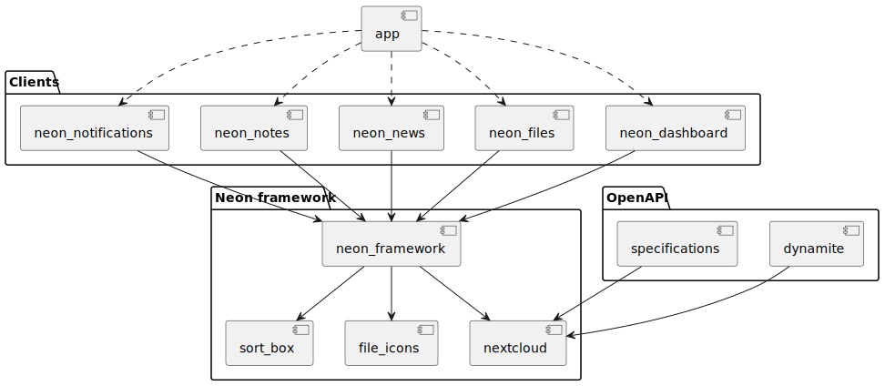

# Architecture overview

The Neon project consists of multiple packages:
- The `nextcloud` package provides implementations for multiple server APIs. These are generated with the `dynamite` generator utilizing the OpenAPI specifications shipping since Nextcloud Hub 6.
- Plugins are special clients that are deeper implemented into the framework and need to be closely coupled with it.
- The individual clients are implemented as separate packages. These depend on the Neon framework and implement a few common interfaces, so they can be used together in apps.
- The main star is the `neon` package that provides common UI components (Widgets) and functionality that is useful for building Nextcloud apps. It also manages the global state at runtime so clients do not have to manage multiple accounts, data fetching or caching.
- On top of all that sits the app package that injects a set of selected clients into the framework. It is possible to configure which one should be included and add custom styling and branding to it.
